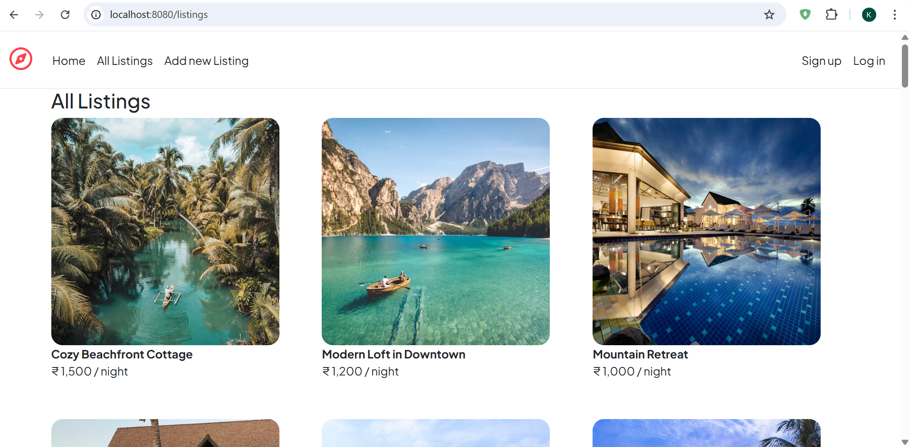
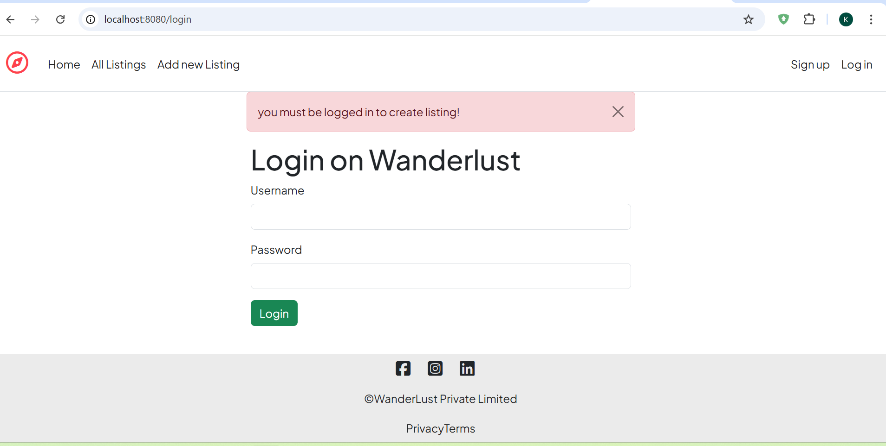
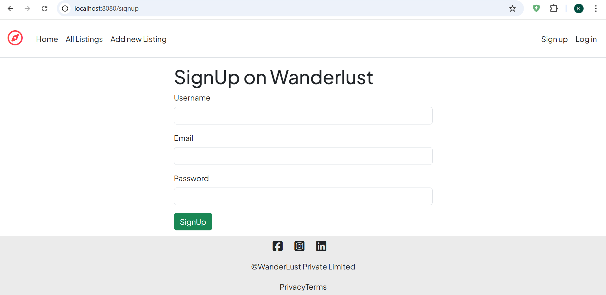

# 🏠 Airbnb Home Listing Site Clone

<div align="center">
  
  ### Full-Stack Accommodation Booking Platform
  
  Built with **MERN Stack** as part of **Delta Batch @ Apna College**
  
  
  
  
  
  
  
  [](https://github.com/harsh-pro-max/airbnb-homeListing-site-clone)
  [](https://github.com/harsh-pro-max/airbnb-homeListing-site-clone/fork)

</div>

---
## 📸 Demo

<div align="center">
  
  ### 🏡 Browse Listings
  
  
  ### 🔍 Listing Details & Reviews
  
  
  ### 🔐 User Authentication
  

</div>


---

## ✨ Features

<table>
<tr>
<td width="50%">

### 🏠 Property Management
- ✅ Full CRUD operations
- ✅ Responsive card layout
- ✅ Image handling
- ✅ Property descriptions

</td>
<td width="50%">

### 🔐 Authentication
- ✅ Secure signup/login
- ✅ Session management
- ✅ Password encryption
- ✅ User authorization

</td>
</tr>
<tr>
<td width="50%">

### ⭐ Reviews & Ratings
- ✅ Add/delete reviews
- ✅ Star rating system
- ✅ User-based authorization
- ✅ Review aggregation

</td>
<td width="50%">

### 🛡️ Security
- ✅ Joi validation
- ✅ Custom middleware
- ✅ Error handling
- ✅ XSS protection

</td>
</tr>
</table>

---

## 🛠️ Tech Stack

```
Backend
├── Node.js          → Runtime environment
├── Express.js       → Web framework
├── MongoDB          → Database
├── Mongoose         → ODM
└── Passport.js      → Authentication

Frontend
├── EJS              → Templating engine
├── Bootstrap 5      → UI framework
└── JavaScript       → Client-side logic

Security
├── Joi              → Schema validation
├── bcrypt           → Password hashing
├── express-session  → Session management
└── connect-flash    → Flash messages
```

---

## 🚀 Quick Start

### Prerequisites
```bash
node --version  # v18+ required
mongod --version  # MongoDB installed
```

### Installation

```bash
# 1. Clone the repository
git clone https://github.com/harsh-pro-max/airbnb-homeListing-site-clone.git
cd airbnb-homeListing-site-clone

# 2. Install dependencies
npm install

# 3. Set up environment variables
cat > .env << EOF
MONGODB_URI=mongodb://localhost:27017/airbnb-clone
SESSION_SECRET=your-super-secret-key-here
PORT=3000
EOF

# 4. Seed database (optional)
node init/index.js

# 5. Start the server
npm start
```

**🌐 Visit:** `http://localhost:3000`

---

## 📁 Project Structure

```
airbnb-homeListing-site-clone/
│
├── models/              # Database schemas
│   ├── listing.js      # Property listings
│   ├── review.js       # Reviews & ratings
│   └── user.js         # User authentication
│
├── routes/              # API endpoints
│   ├── listing.js      # Listing CRUD
│   ├── review.js       # Review management
│   └── user.js         # Auth routes
│
├── views/               # EJS templates
│   ├── listings/       # Listing pages
│   ├── users/          # Auth pages
│   └── layouts/        # Reusable layouts
│
├── public/              # Static assets
│   ├── css/            # Stylesheets
│   └── js/             # Client scripts
│
├── utils/               # Helper functions
├── middleware.js        # Custom middleware
├── schema.js           # Joi validation
└── app.js              # Main application
```

---

## 🎯 Development Phases

### ✅ Phase 1: Foundation (Completed)
- Database modeling & CRUD operations
- EJS templating & responsive design
- Express routing & middleware setup

### ✅ Phase 2: Authentication & Security (Completed)
- User registration & login system
- Review & rating functionality
- Server-side validation with Joi
- Authorization middleware

### 🔄 Phase 3: Advanced Features (In Progress)
- [ ] Image upload with Cloudinary
- [ ] Advanced search & filters
- [ ] Interactive maps integration
- [ ] Booking calendar system
- [ ] Payment gateway
- [ ] Email notifications
- [ ] User dashboard

---

## 🎓 Key Learnings

<table>
<tr>
<td align="center" width="33%">

<br><strong>Database Design</strong>
<br>Schema modeling, relationships
</td>
<td align="center" width="33%">

<br><strong>Security</strong>
<br>Authentication, validation
</td>
<td align="center" width="33%">

<br><strong>RESTful APIs</strong>
<br>CRUD, middleware, error handling
</td>
</tr>
</table>

---

## 📝 API Endpoints

<details>
<summary><b>View All Endpoints</b></summary>

### Listings
```http
GET    /listings          # Get all listings
GET    /listings/:id      # Get single listing
POST   /listings          # Create listing (Auth required)
PUT    /listings/:id      # Update listing (Owner only)
DELETE /listings/:id      # Delete listing (Owner only)
```

### Reviews
```http
POST   /listings/:id/reviews        # Add review (Auth required)
DELETE /listings/:id/reviews/:rid   # Delete review (Author only)
```

### Authentication
```http
GET    /signup          # Signup page
POST   /signup          # Register user
GET    /login           # Login page
POST   /login           # Authenticate user
GET    /logout          # Logout user
```

</details>

---

## 🤝 Connect With Me

<div align="center">

**Harsh Kushwah**  
🎓 Full-Stack Developer in Training | 📚 Delta Batch @ Apna College

[](https://github.com/harsh-pro-max)
[](https://linkedin.com/in/your-profile)
[](https://your-portfolio.com)

</div>

---

## 🙏 Acknowledgments

- **[Shradha Khapra](https://www.linkedin.com/in/shradha-khapra/)** - Mentor & Instructor
- **[Apna College](https://www.apnacollege.in/)** - Delta Batch Program
- **Delta Batch Community** - Fellow learners & supporters

---

## 📄 License

This project is built for educational purposes as part of the Delta Batch curriculum.

---

<div align="center">

### ⭐ Star this repo if you found it helpful!

**Made with ❤️ by [Harsh Kushwah](https://github.com/harsh-pro-max)**

*Last Updated: October 26, 2025*

</div>